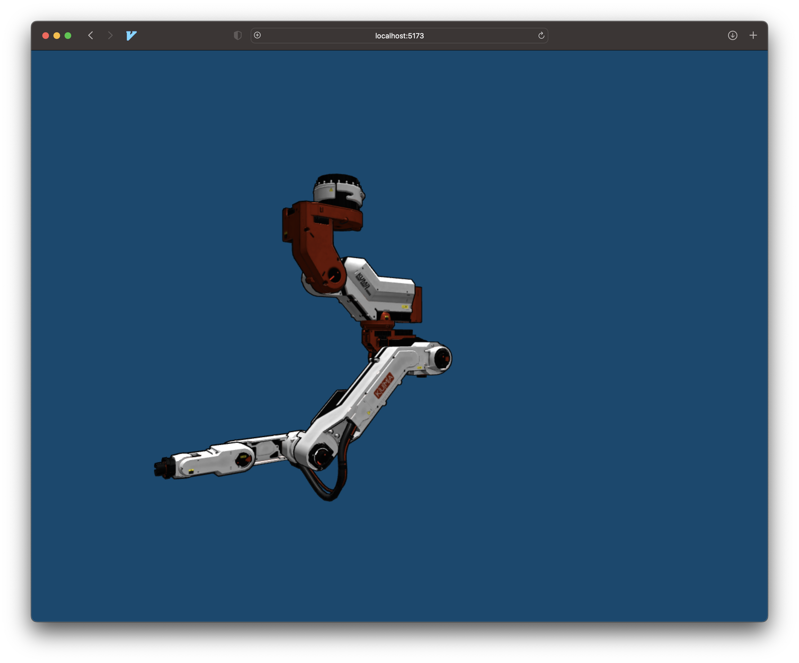

## Interactive 3d Model 

This __TypeScript__ script is used to create an interactive 3D model viewer using the __Three.js__ library. The script includes the following key components:

1. **Imports**: Import the required Three.js components and the GLTFLoader for loading 3D models.
2. **Create Renderer**: Set up a WebGLRenderer with antialiasing and specify the canvas element.
3. **Create Camera**: Create a PerspectiveCamera with an initial position.
4. **Create Scene**: Set up a scene with ambient, directional, and point lights.
5. **Handle Window Resize**: Update the renderer size and camera aspect ratio when the window is resized.
6. **Load Model**: Load a GLTF model using the GLTFLoader and add it to the scene.
7. **Setup Zoom Controls**: Add zoom controls for the camera using mouse wheel events.
8. **Setup Drag Controls**: Implement drag controls for the model with mouse and touch events.
9. **Animate Camera**: Animate the camera's position to move around the model.
10. **Main Render Loop**: Continuously render the scene and update the camera.

At the end of the script, the main execution takes place, setting up the renderer, camera, scene, and all the controls. A window resize event listener is also added to handle changes in the browser window size.

## 3D model resources
With respect to the original owners of the 3d models I have linked the files
below:

Robot arm: 

https://sketchfab.com/3d-models/kuma-heavy-robot-r-9000s-8b77bdbe705f4e9697790fd404da49a90

Robot drone:

https://sketchfab.com/3d-models/obot-cute-robot-challenge-17fe944bd57941cabb698fe9d0a4f3c2

Adams head:

https://sketchfab.com/3d-models/adam-head-a7d347b738c041579a8790f539fe0d8f

## Intension of this repo

I was having a hard time getting three js to work as a component in Svelte using
typescript. Instead of constantly breaking my brain on every single bug I felt
like playing around with this library first before implementing it. It was
really hard to find a good free resource on how things could be set up in
typescript.

So this file is written using seperate functions for different taks making it
more modular and easier to maintain. I was optionally thinking of making it more
configurable adding more functions like different file loaders and a config file
having for camera position or lighting etc.
